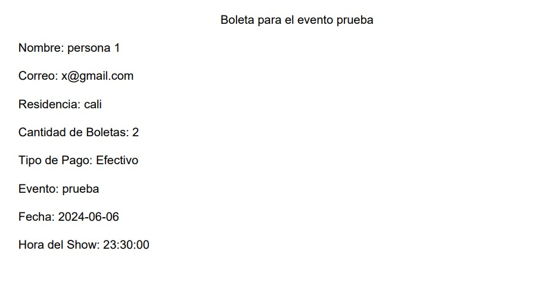
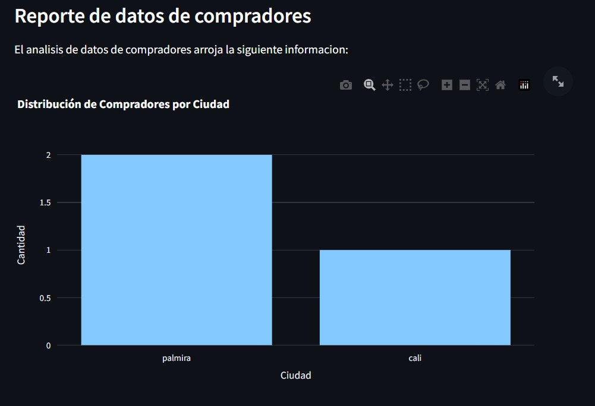

# README
**Proyecto: Sistema de Gestión de Eventos de Comedia**

## Descripción y principales funciones
El sistema permite la administración de eventos de comedia en tres tipos diferentes de ubicaciones, cada una con pequeñas diferencias entre sí. El usuario, en este caso el administrador, podrá gestionar la creación y eliminación de eventos, así como sus detalles, tales como precio, hora de inicio, lugar, aforo, estado, etc. También podrá agregar artistas a los eventos y vender boletos, ya sea en preventa, cortesía o regular.

Además, el sistema es capaz de generar reportes con información sobre los boletos vendidos, los ingresos de las ventas, los artistas y los eventos en los que han participado. También incluye un análisis demográfico y de edades de los compradores para futuras estrategias de marketing.

Adicionalmente, cuenta con con mensajes que comunican el estado de las acciones del usuario en el sistema, la posibilidad de filtrar eventos por fechas y de descargar información, como las gráficas generadas en los reportes o los boletos vendidos, en formato Excel y PDF respectivamente.

El sistema está compuesto por varias clases que se organizan en la vista (View) para su visualización. Las funciones principales se organizan en el controlador (Controller), donde se hace uso de contenedores para almacenar objetos o información de artistas, usuarios, eventos y patrocinadores, con el fin de facilitar el acceso a la información de cada uno y mantener un mayor orden y registro histórico. Para interactuar con el usuario, se utilizan menús que facilitan la navegación en el programa y el acceso a las funciones que este permite. Además, cuenta con un inicio de sesión para mantener la información segura y separada para el uso de un usuario en específico.

## Ejemplo de funcionalidad

A continuación se muestran imágenes de como se ve el sistema funcionando.

Al entrar lo primero que se ve la pantalla de inicio de sesión.

Después de ingresar las credenciales, se muestra una pantalla de filtrado de eventos y un menú con opciones para crear y gestionar eventos, agregar artistas y salir del sistema. Al seleccionar crear evento, el usuario deberá ingresar la información básica del nuevo evento, como el nombre, la fecha, la hora, el lugar, los precios, entre otros detalles relevantes. Posteriormente, internamente, el sistema guarda el evento en su base de datos.

Al seleccionar editar evento se permite cambiar el estado del evento. Venta boleta solicita detalles como el tipo de boleto, información del comprador, detalles de la venta y el método de pago utilizado. Posterior a esto se da la opción de descargar un PDF con la información.

Las última opción de gestión permite elegir entre varias opciones de generación de reportes, que incluyen reportes de ventas, financieros, de compradores y de artistas. Cada uno de estos reportes proporciona información clave sobre un tema específico que puede ser analizada y utilizada para simplificar la información para futuros análisis o presentaciones de datos, ademas de tambien tener graficas para visualizar mejor la información que ademas son descargables como archivo de Excel.

Finalmente, la opción de eliminar evento permite borrar un evento de la base de datos, lo que lo excluye del sistema y ya no se puede manipular. Es importante destacar que esta opción solo es posible si el evento no ha vendido boletas.

